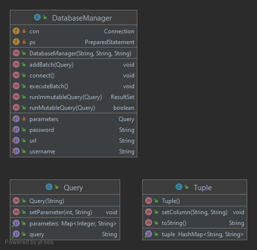

# Tesi - Clientside Encryption Driver
Sviluppo di un driver per l'abilitazione della cifratura a livello client per il lavoro di tesi riguardo la Database Encryption.

## Indice
* [Scenario](#scenario)
 * [Architettura del software](#architettura-del-software)
    + [Package Core](#package-core)
      - [Package Database](#package-database)
        * [DatabaseManager class](#databasemanager-class)
        * [Query class](#query-class)
        * [Tuple class](#tuple-class)
      - [Package Crypto](#package-crypto)
      - [Package Keystore](#package-keystore)
        * [KeystoreInfo class](#keystoreinfo-class)
        * [KeystoreUtils class](#keystoreutils-class)
      - [Package Token](#package-token)
        * [Token interface](#token-interface)
        * [Encrypted Token](#encrypted-token)
        * [ClearToken](#cleartoken)
        * [Token Parser](#token-parser)
      - [Package Logger](#package-logger)
      - [Package Exception](#package-exception)
      - [Package Examples](#package-examples)
      - [Configuration class](#configuration-class)
    + [CryptoDatabaseAdapter class](#cryptodatabaseadapter-class)
      - [Builder](#builder)
      - [QueryBuilder](#querybuilder)
      - [CryptoDatabaseAdapter](#cryptodatabaseadapter)
## Scenario

La **Clientside Encryption**  è una tecnica crittografica che consiste nel cifrare i dati client-side ovvero sul client prima di essere trasmessi ad un server online.

## Architettura del software
La seguente figura mostra la struttura del Clientside Encryption Package e i suoi possibili utilizzi da parte di una applicazione client.

Il software si comporta come una interfaccia per accedere al database (per ora è supportato solo MySQL) ed è composto da un package denominato Core e da una classe denominata CryptoDatabaseAdapter.

### Package Core
Il package ***Core*** rappresenta il nucleo del sistema ed è composto da diversi package per la gestione del database, keystore, crittografia e logging. 

- Package *Database*: gestisce la comunicazione con il database.
- Package *Crypto*: gestisce le operazioni crittografiche.
- Package *Keystore*: gestisce le operazioni sul keystore.
- Package *Token*: modella un Token (è il dato salvato sul DB).
- Package *Logger*: gestisce il logging su file.
- Package *Exceptions*: contiene tutte le eccezioni utilizzate.
- Package *Examples*: contiene tre piccoli programmi che mostrano l'utilizzo del package Core.
- Classe *Configuration*: modella la configurazione di CryptoDatabaseAdapter.

#### Package Database
La seguente immagine mostra il diagramma UML del package:

##### DatabaseManager class
Si tratta di una classe dove il costruttore richiede tre stringhe ovvero l'url del database, username e password per accedere al database. Offre i seguenti metodi:
- connect(): permette la connessione al DB con i parametri specificati nel costruttore.
- runImmutableQuery(Query): esegue una query di tipo SELECT.
- runMutableQuery(Query): esegue una query non di tipo SELECT ma che modifica il database (ad esempio UPDATE).
- addBatch(Query): inserisce una query nel batch (per una esecuzione più veloce, utile nelle INSERT e UPDATE).
- executeBatch(): esegue le query contenute nel batch.

##### Query class
Modella una query da inviare al database. Il costruttore richiede una stringa che corrisponde ad una query parametrizzata dove il parametro è segnato con un '?' (ad esempio SELECT + FROM TABELLA WHERE id=?). Offre il seguente metodo:
- setParameter(int,String): permette di settare una stringa come parametro alla posizione specificata. Al momento sono supportate solo le stringhe come parametro delle query.

##### Tuple class
Modella una tupla ritornata dal database. Viene usata per ritornare i risultati di na SELECT al client. Offre i seguenti metodi:
- setColumn(String, String): permette di inserire il mapping tra il nome della colonna e l'attributo (ad esempio ID: 1).
- toString(): ritorna l'oggetto Tuple in formato stringa che corrisponde ad una mappa in formato stringa.

#### Package Crypto
La seguente immagine mostra il diagramma UML del package:

È composto da una classe static che offre il supporto alle operazioni crittografiche. Gli algoritmi supportati sono quelli dell'enum Algorithm e sono AES128, AES192 e AES256 tutti in modalità GCM, preferito per i vantaggi dell'authenticated encryption (non solo confidenzialità ma anche verifica dell'integrità e autenticazione).
Offre i seguenti metodi:
- createKeyFromPassword(Algorithm, char[], byte[]): permette di creare una chiave segreta partendo da una password ed applicando una Key Derivation Function che prende come input il sale e la password.
- CreateSymKey(Algorithm): permette di creare una chiave simmetrica per l'algoritmo specificato.
- decryptData(SecretKey,byte[],byte[]): permette di decrifrare dei dati utilizzando la chiave simmetrica e l'iv passati come parametri.
- decryptDataWithPrefixIV(SecretKey, byte[]): permette di estrarre l'iv dai dati cifrati ed infine decifrarli.
- encryptData(SecretKy, byte[], byte[]): permette di cifrare dei dati utilizzando la chiave simmetrica e l'iv passati come parametri.
- encryptDataWithPrefixIV(SecretKey, byte[]): permette di cifrare i dati ed inserire l'iv in essi.
- getRandomNonce(int): ritorna un nonce della dimensione specificata.

Per quanto riguarda la Key Management, nel keystore viene salvata la Master Encryption Key che viene utilizzata per cifrare/decifrare la Encryption Key generata on-the-fly ogni volta che c'è un nuovo dato da cifrare ed inserita con esso (in un token) nel database.
#### Package Keystore
La seguente immagine mostra il diagramma UML del package:

##### KeystoreInfo class
Si tratta di una classe che modella le informazioni del keystore ovvero il keystore stesso (un file pkcs12) e la password che lo protegge. Il costruttore riceve come parametri un oggetto di tipo Keystore e una stringa che rappresenta la password.

##### KeystoreUtils class
Si tratta una classe static che offre il supporto alla gestione del keystore. Il tipo di keystore supportato è un file .p12.
Offre i seguenti metodi:
- createKeystore(String): permette di creare un oggetto di tipo Keystore e proteggerlo con la password passata come parametro.
- deleteKeystore(String): permette di eliminare il keystore salvato al path del filesystem specificato.
- deleteKey(KeystoreInfo, String): permette di eliminare la chiave con il nome specificato dal keystore passato come parametro.
- existKey(KeystoreInfo, String): permette di verificare se uno specifico keystore contiene una chiave dove il nome è passato come parametro.
- existKeystore(String, String): permette di verificare se uno specifico keystore esiste nel filesystem.
- getKey(KeystoreInfo, String): ritorna la chiave specificata dal keystore.
- insertKey(KeystoreInfo, SecretKey, String): permette di inserire una chiave nel keystore protetto dalla password specificata.
- loadKeystore(String, String): permette di caricare il keystore in memoria dal filesystem.
- saveKeystore(KeystoreInfo, String): permette di salvere il keystore nel filesystem.

#### Package Token
La seguente immagine mostra il diagramma UML del package:

##### Token interface
Rappresenta l'astrazione di un token che corrisponde al dato salvato nel database.

##### Encrypted Token
Si tratta di un classe che implementa l'interfaccia Token e modella i dati cifrati nel DB. Ridefinisce il metodo generateToken() che genera il token nel seguente modo: ***'CIPHERTEXT'.Base64(ciphertext).Base64(cipherkey)*** dove ***ciphertext*** sono i dati cifrati con la chiave di cifratura EK generata on-the-fly mentre ***cipherkey*** è la chiave EK cifrata con la Master Encryption Key memorizzata nel keystore. 

##### ClearToken
Si tratta di una classe che implementa l'interfaccia Token e modella i dati in chiaro nel DB. Ridefinisce il metodo generateToken() che genera il token nel seguente modo: ***'PLAINTEXT'.Base64(plaintext)*** dove ***plaintext*** corrisponde ai dati in chiaro.

##### Token Parser
Si tratta di una classe static che permette di estrarre le informazioni contenute nel token esaminando l'header ritornando Token.

#### Package Logger
Contiene le classi per implementare un sistema di logging basato su file. Il file di log viene salvata nella cartella ./src/main/resources .

#### Package Exception
Contiene le eccezioni utilizzate dal sistema per la gestione degli errori riguardo l'IO, Database, Keystore e operazion crittografiche.

#### Package Examples
Contiene dei programmi di esempio di utilizzo e funzionamento del sistema

#### Configuration class
La seguente figura mostra il diagramma UML:

Il costruttore riceve sei stringhe come parametri ovvero l'url del database, username e password per il database, il percorso del filesystem dove è presente il keystore, la password che protegge il keystore e il nome della Master Encryption Key.

Il metodo validate() controlla se tutti i campi sono settati e non null.

### CryptoDatabaseAdapter class
Si tratta di una classe per l'utilizzo trasparente del sistema (senza utilizzare direttamente le classi fornite dal package Core). Una applicazione client può istanziare un oggetto di tipo CryptoDatabaseManager, configurarlo e infine interagire con esso per eseguire query al database.

La seguente figura mostra il diagramma UML:

 

La classe CryptoDatabaseAdapter possiede due inner class, Builder e QueryBuilder.

#### Builder
Si tratta di una classe statica che abilita il Builder Pattern, ovvero viene utilizzata per creare e configurare un oggetto di tipo CryptoDatabaseAdapter. Sono possibili due diversi metodi di configurazione:
- Attraverso un file di configurazione (vedi ./src/main/resources/config.properties) e richiamando il metodo buildByFile(path) dove path è il percorso del filesystem dove è situato il file di configurazione.
- Richiamando i metodi set*Property* che vanno a configurare un singolo parametro alla volta.

Il metodo build() valida la configurazione e in caso positivo crea e ritorna un oggetto di tipo CryptoDatabaseAdapter.

#### QueryBuilder
Si tratta di una classe che permette la creazione e configurazione dei parametri di una query. Il costruttore riceve come parametro una stringa in formato parametrico (con '?'). Offre i seguenti metodi:
- setCipherParameter(int, String, Algorithm): permette di impostare un parametro e cifrarlo con l'algoritmo specificato nei parametri.  
- setParameter(int, String): permette di impostare un parametro in chiaro nella query.
- run(): esegue una query che modifica il DB (ad esempio UPDATE).
- runSelect(): esegue una query di tipo SELECT, estrae ed eventualmente decifra i dati cifrati e li ritorna all'applicazione client in modo trasparente.
- addToBatch(): permette di inserire la query costruita in un batch.

#### CryptoDatabaseAdapter
Si tratta della classe che si intefaccia con l'applicazione client. Il costruttore è privato e richiamabile solo dal Builder. Offre i seguenti metodi:
- init(): inizializza il sistema (da richiamare sempre).
- newQueryBuilder(String): permette di costruire un oggetto di tipo QueryBuilder per costruire, configurare ed eseguire una query.
- executeBatch(): esegue le istruizioni contenute nel batch.
- 
La cartella Examples mostra possibili utilizzi della classe CryptoDatabaseAdapter.

